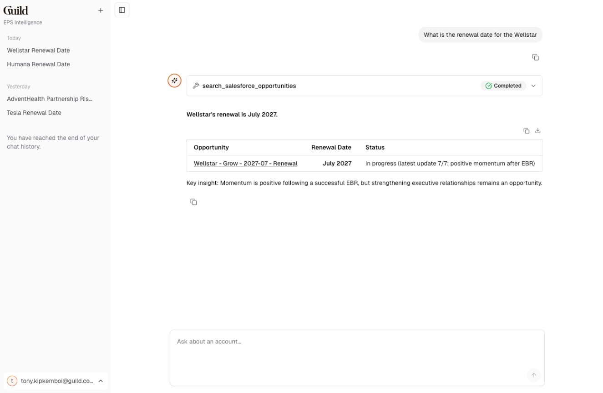

# EPS Intelligence

An AI-powered account intelligence agent for Guild's Employer Partner Success (EPS) team. Get instant insights about employer accounts by querying data from Salesforce, Google Drive, Gong, Gmail, Slack, and more.



## Features

- **Account Intelligence**: Ask questions about any employer partner account
- **Multi-Source Integration**: Pulls insights from Salesforce, Google Drive, Gong call recordings, Gmail, and Slack via Glean
- **Persistent Chat History**: Conversations are saved to Databricks Lakebase for future reference
- **Databricks Authentication**: Secure access via Databricks identity

## Quick Start

### Prerequisites

1. **Node.js 18+** and **npm 8+**
2. **Databricks CLI** - [Installation guide](https://docs.databricks.com/en/dev-tools/cli/install.html)
   ```bash
   brew install databricks
   ```
3. Access to the Guild Databricks workspace

### Setup

1. **Clone and install**:
   ```bash
   git clone <repo-url>
   cd eps-chatbot
   npm install
   ```

2. **Configure authentication**:
   ```bash
   export DATABRICKS_CONFIG_PROFILE='eps_chatbot'
   databricks auth login --profile "$DATABRICKS_CONFIG_PROFILE"
   ```

3. **Set up environment**:
   ```bash
   cp .env.example .env.local
   # Edit .env.local with your configuration
   ```

4. **Run the app**:
   ```bash
   npm run dev
   ```

   Open [localhost:3000](http://localhost:3000)

For detailed setup instructions including Lakebase database configuration, see [SETUP.md](./SETUP.md).

## Example Queries

- "What is the renewal date for Wellstar?"
- "Are there any risks to the AdventHealth partnership?"
- "Show me the latest Gong calls for Target"
- "What's the operational health score for Walmart?"

## Architecture

This is a full-stack application built with:

- **Frontend**: React + Vite + Tailwind CSS
- **Backend**: Express.js + Vercel AI SDK
- **Database**: Databricks Lakebase (PostgreSQL)
- **AI**: Databricks Agent Serving endpoint with Glean integration

```
eps-chatbot/
├── client/          # React frontend
├── server/          # Express backend
└── packages/        # Shared libraries
    ├── core/        # Domain types, errors, schemas
    ├── auth/        # Authentication utilities
    ├── ai-sdk-providers/  # Databricks AI SDK integration
    ├── db/          # Database layer (Drizzle ORM)
    └── utils/       # Shared utilities
```

## Deployment

Deploy to Databricks Apps using Asset Bundles:

```bash
# Validate configuration
databricks bundle validate

# Deploy
databricks bundle deploy

# Start the app
databricks bundle run databricks_chatbot
```

See [SETUP.md](./SETUP.md) for detailed deployment instructions.

## Development

### Commands

| Command | Description |
|---------|-------------|
| `npm run dev` | Start development server |
| `npm run build` | Build for production |
| `npm run db:migrate` | Run database migrations |
| `npm run db:studio` | Open Drizzle Studio (visual DB editor) |
| `npm test` | Run all tests |
| `npm run lint` | Lint and format code |

### Code Quality

This project uses [Biome](https://biomejs.dev/) for linting and formatting (not ESLint/Prettier).

```bash
npm run lint      # Lint with auto-fix
npm run format    # Format only
```

## Documentation

- [SETUP.md](./SETUP.md) - Detailed setup and configuration guide
- [CLAUDE.md](./CLAUDE.md) - AI assistant context for development

## Support

For issues or questions, contact Tony Kipkemboi (Business Systems & IT team).
