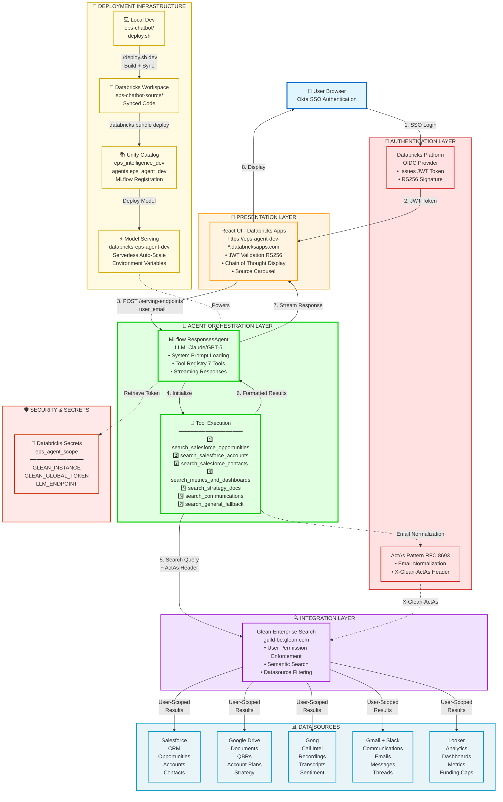

# EPS Account Intelligence Agent - High-Level Architecture



## Key Components

| Layer | Component | Purpose |
|-------|-----------|---------|
| **Presentation** | React UI (Databricks Apps) | User interface with JWT validation, Chain of Thought display |
| **Authentication** | Databricks OIDC + ActAs | OAuth 2.0 flow with user impersonation pattern |
| **Agent** | MLflow ResponsesAgent | LLM-powered agent with tool execution capability |
| **Tools** | 7 Search Tools | Specialized tools for different data sources and types |
| **Integration** | Glean Enterprise Search | Unified search API with permission enforcement |
| **Data Sources** | 5 Enterprise Systems | Salesforce, Drive, Gong, Gmail/Slack, Looker |
| **Deployment** | Databricks Infrastructure | Unity Catalog, Model Serving, Serverless Compute |
| **Security** | Secrets + Audit | Encrypted tokens, complete audit trail, user-scoped access |

## Data Flow Summary

```
User Query → JWT Validation → Agent (LLM) → Tool Selection →
Glean Search (ActAs) → Data Sources → Results → Agent Synthesis →
Stream Response → UI Display
```

## Security Properties

- ✅ **User Identity**: Verified by Databricks (cannot be spoofed)
- ✅ **Token Security**: Global token encrypted, never exposed to browser
- ✅ **Permission Enforcement**: Glean enforces actual user permissions
- ✅ **Audit Trail**: Complete logging with actual user identity

## Deployment Command

```bash
cd /Users/tonykipkemboi/Workspace/eps-chatbot
./deploy.sh dev
```

**Time to Deploy**: 3-5 minutes
